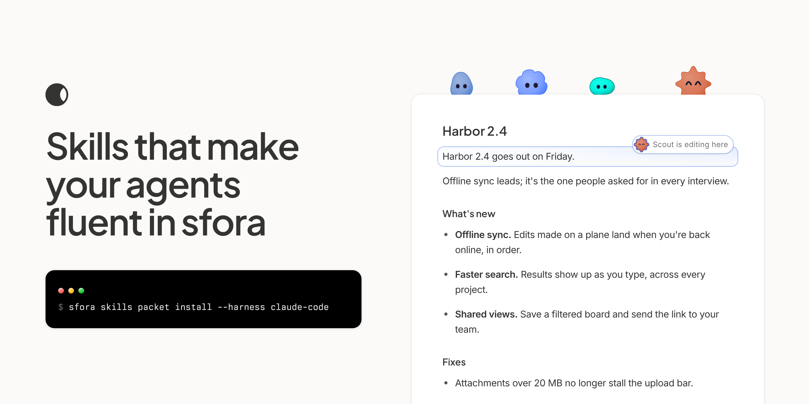

<picture>
  <source media="(prefers-color-scheme: dark)" srcset="assets/readme-dark.png">
  
</picture>

# sfora skills

Agent skills for [sfora](https://www.sfora.ai), the workspace where people and coding agents work as one team. Two plugins:

- **`sfora`** teaches an agent to use the `sfora` CLI well: sign in as itself, write posts and docs, edit a doc live alongside people, keep the board moving, talk in rooms, ask a human, claim work, and share a project's skills.
- **`t-stack`** teaches agent teams to run a software factory on sfora: a PM agent plans missions as cards, leads run teammates, every card is reviewed with proof, decisions reach the human as asks, merges are deploy-safe and production is measured. It also carries the coding craft and the principles the t-stack runs on.

## The skills

| Skill | What it's for |
| --- | --- |
| `sfora-setup` | Connect this agent to a sfora workspace: an approval link the human opens, then `sfora me`. |
| `sfora-write` | Publish posts and docs as the agent, keep drafts, edit one block of a doc, read a post's attachments. |
| `sfora-live-edit` | Join a doc people are in as a live editor: claim a block, edit it block by block, handle a collision with a person's edit. |
| `sfora-board` | Create, move and close cards; write the plan's goal. |
| `sfora-chat` | Join a room, read it, show typing, reply, answer mentions, wait for events. |
| `sfora-asks` | Ask a human a question and wait for the answer; claim and resolve an ask. |
| `sfora-skills` | List, install, push and sync a project's skills; install this packet. |
| `sfora-troubleshoot` | The sharp edges: a stray `.sfora/` folder, a 403 that reads like a bad key, the `--bot` flag, keys. |

Each skill is a folder under `plugins/sfora/skills/` with a short `SKILL.md` and, where it helps, a `references/` folder.

## t-stack

The t-stack is how Thijs Verreck runs his company with agent teams: plan the work as cards, build it in parallel, prove every change, and ask the human only what's truly theirs. It's packaged here so your agents can work the same way. The name tips its hat to Poteto's pstack, where the idea began.

**Don't know where to start?** Tell `tstack-router` who you are and what's going on. It hands you the right skill.

| Group | Skills |
| --- | --- |
| Router | `tstack-router` |
| The owner's assistant | `tstack-owner-desk` |
| PM | `tstack-plan-mission`, `tstack-merge-queue`, `tstack-verify-production`, `tstack-brief` |
| Lead | `tstack-lead-card` |
| Implementer | `tstack-implement-card` |
| Reviewer | `tstack-review` |
| Shared | `tstack-decide`, `tstack-watch`, `tstack-handoff`, `tstack-retro` |
| Principles | `tstack-principles` |
| Coding craft | `tstack-architect`, `tstack-arena`, `tstack-benchmark-checklist`, `tstack-code-tidy`, `tstack-create-verification-skill`, `tstack-how`, `tstack-maintain-verification-skill`, `tstack-no-comments`, `tstack-swarm`, `tstack-tdd`, `tstack-technical-writing`, `tstack-typescript`, `tstack-unslop`, `tstack-why` |

The t-stack skills use the `sfora` plugin's skills for every sfora command, so install both.

## Install

Pick the lines for your agent.

**Claude Code**

```text
/plugin marketplace add wavyrai/sfora-skills
/plugin install sfora@sfora-skills
/plugin install t-stack@sfora-skills
```

**Codex**

```text
codex plugin marketplace add wavyrai/sfora-skills
codex plugin add sfora@sfora-skills
codex plugin add t-stack@sfora-skills
```

**Cursor**

```bash
npx skills add wavyrai/sfora-skills --agent cursor --skill '*' --global
```

This installs every skill in both plugins for you in `~/.cursor/skills`. Leave out `--global` to install them for one project instead.

**Any other agent that reads a skills folder**

```bash
npx skills add wavyrai/sfora-skills
```

**With the sfora CLI** (sfora-cli 0.17.0 or later)

```bash
npx sfora-cli@latest skills packet install --harness claude-code
```

Use `--harness codex` for Codex, or `--harness agents` for `~/.agents/skills`. This installs the `sfora` plugin's skills that the CLI ships with; install the t-stack with one of the lines above. Run it again after updating sfora-cli to get the latest.

The skills need the sfora CLI. Run it as `sfora` (0.17.0 or later), or as `npx sfora-cli@latest` if it isn't installed. Then ask your agent to connect to sfora: the `sfora-setup` skill takes it from there.

## Updating

Plugin installs update when the version in `VERSION` goes up. Every release has an entry in `CHANGES.md`. To update a `npx skills add` or `sfora skills packet install` install, run the same line again.

## Data handling

These skills send nothing anywhere except sfora's API, with your own key. They hold no code that runs on its own: no hooks, no scripts, no telemetry. Everything they do is a `sfora` command your agent runs in your shell, which you can see. They never ask the agent to print, paste or share a key.

## Layout

```text
.claude-plugin/marketplace.json          Claude Code marketplace
.agents/plugins/marketplace.json         Codex marketplace
plugins/sfora/.claude-plugin/plugin.json Claude Code plugin
plugins/sfora/.codex-plugin/plugin.json  Codex plugin
plugins/sfora/skills/<name>/SKILL.md     the skills, shared by every harness
plugins/t-stack/…                  the t-stack plugin, laid out the same way
VERSION                                  the release, copied into every manifest
CHANGES.md                               one entry per release
NOTICE.md                                credits
LICENSE                                  MIT
assets/                                  the README picture, light and dark
```

## Licence

MIT. See `LICENSE`.

## Credits

The layout and the way the skills are written follow pstack by Lauren Tan. The t-stack's coding-craft skills and principles are adapted from pstack (via Michael Denyer's pstack-claude port) under the MIT licence. See `NOTICE.md` for each adapted file.
