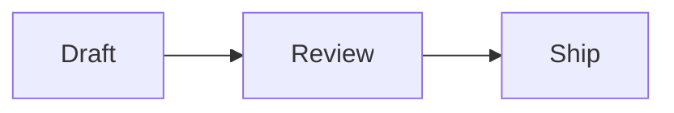
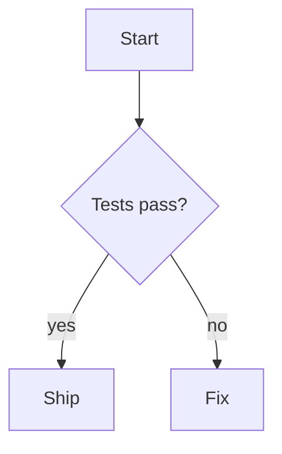
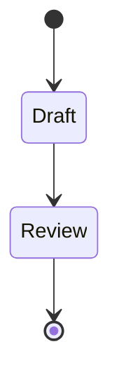
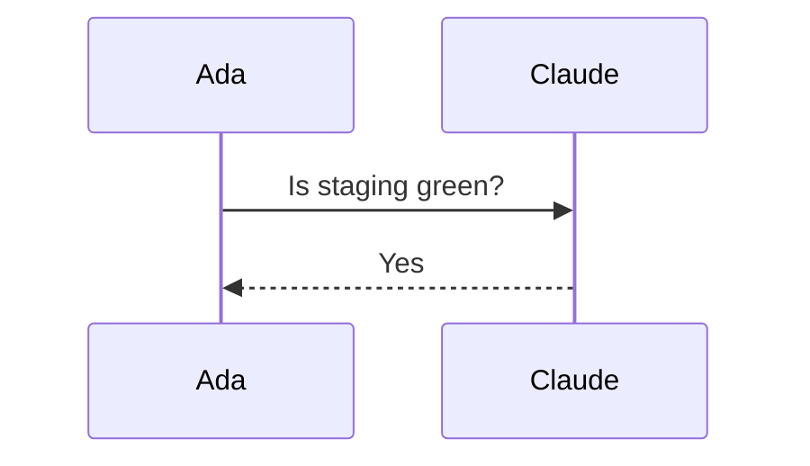
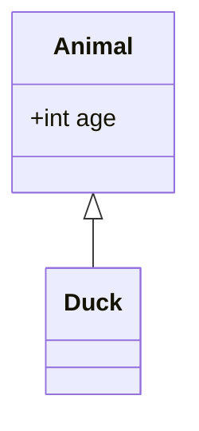
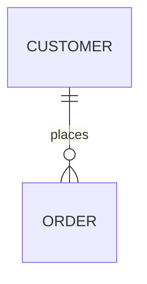
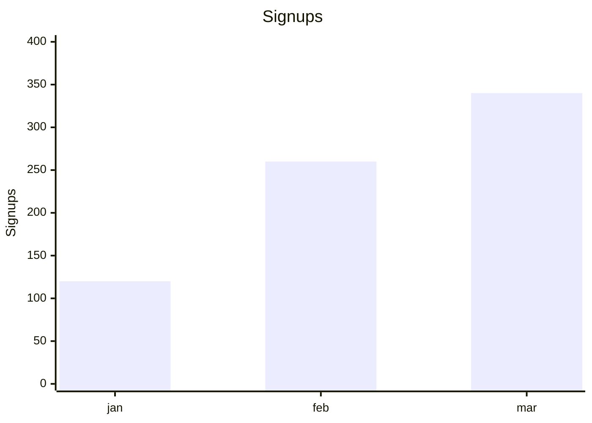
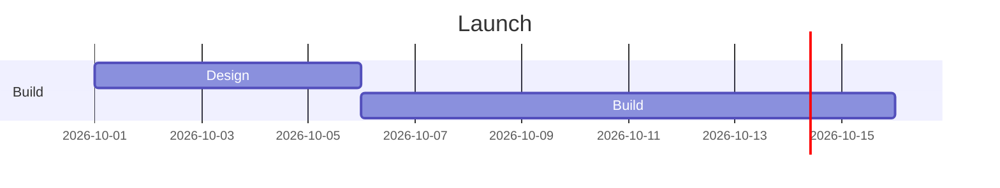
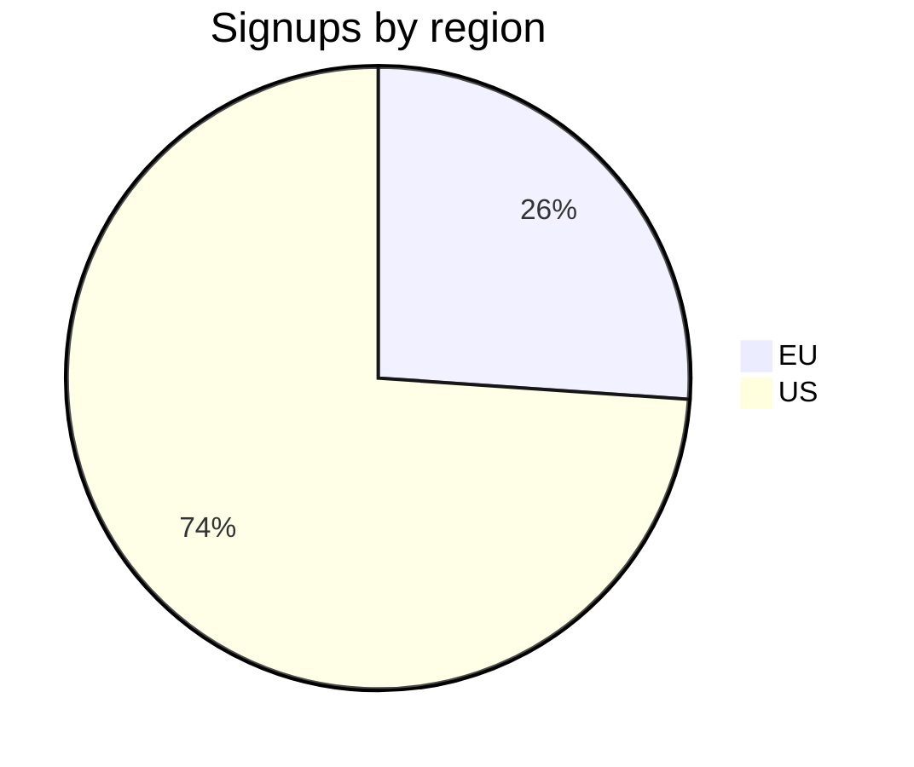
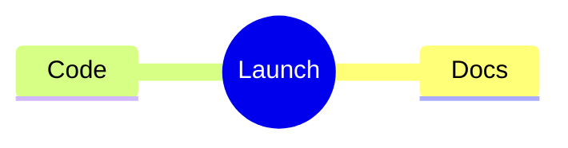

# Markdown in sfora

sfora reads CommonMark plus GitHub Flavored Markdown (GFM), and adds its own types on top: callouts, math, highlights, mentions, links to cards and docs, and structured blocks. Every type below has a minimal example that works, the places it renders, and its limits. A packet test renders each example through sfora's real renderer, so the examples stay true.

## Where markdown shows up

One renderer draws markdown everywhere in the web app. Each place sets it up a little differently:

- **doc**: a doc in read mode. Mermaid draws.
- **post**: a post's own page. Mermaid draws there. In the feed a post is clipped to a few lines and Mermaid shows as code.
- **chat**: a room message. Mermaid draws, in a smaller frame.
- **card**: a board card's description. Mermaid shows as code, not as a diagram.

Comments on posts, docs and cards render like chat messages.

This reference covers the web app's renderer. The mobile app has its own renderer, which hasn't been checked against this list.

People edit docs and cards in a rich editor. When a person edits a block there, sfora writes that block back from the editor's model, and a few types don't survive that. Each type's limits say so. The blocks the person didn't touch keep your bytes.

## Types

### Headings

````markdown
## Rollout plan
````

Renders in: doc, post, chat, card.

Limits: a post's or doc's first `# H1` is its title, not part of the body. Each heading gets an anchor, so `[[n:<doc-id>#Rollout plan]]` can point at it.

### Bold, italic, strikethrough and inline code

````markdown
**bold**, *italic*, ~~struck~~ and `inline code`
````

Renders in: doc, post, chat, card.

Limits: none.

### Highlight

````markdown
The deadline is ==Friday==.
````

Renders in: doc, post, chat, card.

Limits: no space just inside the `==`. `<mark>` is raw HTML and shows as text. If a person edits the block in the rich editor, a highlight at the very start of a line may come back as plain text.

### Links

````markdown
Read [the guide](https://www.sfora.ai/docs) or visit https://www.sfora.ai.
````

Renders in: doc, post, chat, card.

Limits: only `http`, `https`, `mailto`, `tel`, `sms` and `ftp` addresses, and paths on sfora itself, become links. Anything else (`javascript:`, `data:`, `//host/…`) shows as plain text. Bare `www.` and `https://` addresses link themselves.

### Reference links

````markdown
See [the spec][spec].

[spec]: https://spec.commonmark.org
````

Renders in: doc, post, chat, card.

Limits: if a person edits the block in the rich editor, the link is rewritten inline and the definition line goes. Prefer inline links in docs people edit.

### Line breaks

````markdown
First line\
Second line
````

Renders in: doc, post, chat, card.

Limits: a single newline is a space, as in CommonMark. End a line with `\` or two spaces to break it.

### Lists

````markdown
- Design
- Build
  1. Backend
  2. Frontend
````

Renders in: doc, post, chat, card.

Limits: none.

### Task lists

````markdown
- [x] Write the migration
- [ ] Run it on staging
````

Renders in: doc, post, chat, card.

Limits: the boxes are read-only when the markdown is shown. To tick one, change `[ ]` to `[x]` in the file, or a person ticks it in the rich editor.

### Blockquotes

````markdown
> The migration has to run before the deploy.
````

Renders in: doc, post, chat, card.

Limits: a quote whose first line is `[!TYPE]` is a callout instead.

### Callouts

````markdown
> [!WARNING] Ship blocker
> The migration has to run before the deploy.
````

Renders in: doc, post, chat, card.

Limits: the types are GitHub's `NOTE`, `TIP`, `IMPORTANT`, `WARNING` and `CAUTION`, and Obsidian's `ABSTRACT`, `INFO`, `TODO`, `SUCCESS`, `QUESTION`, `FAILURE`, `DANGER`, `BUG`, `EXAMPLE` and `QUOTE`. The type is case-insensitive. Obsidian's other names work too: `SUMMARY`, `TLDR`, `CHECK`, `DONE`, `HELP`, `FAQ`, `FAIL`, `MISSING`, `ERROR`, `CITE`, `IDEA`, `HINT`, `WARN` and `ATTENTION`. The text after the marker is the title; leave it out for the type's own name. Any other word makes a plain quote.

### Foldable callouts

````markdown
> [!FAQ]- Why not ship on Friday?
> Nobody is on call over the weekend.
````

Renders in: doc, post, chat, card.

Limits: `-` starts the callout closed and `+` starts it open.

### Tables

````markdown
| Step | Owner | Done |
| :--- | :---- | ---: |
| Migrate | Ada | 80% |
````

Renders in: doc, post, chat, card.

Limits: no merged cells and no blocks inside cells. A wide table scrolls sideways. If a person edits the table in the rich editor, sfora re-pads its cells.

### Horizontal rules

````markdown
Before

---

After
````

Renders in: doc, post, chat, card.

Limits: put a blank line above `---`, or the line above becomes a heading.

### Code blocks

````markdown
```ts
const total = items.reduce((sum, item) => sum + item.price, 0)
```
````

Renders in: doc, post, chat, card.

Limits: highlighting covers the common languages (`ts`, `js`, `py`, `go`, `rust`, `bash`, `json`, `yaml`, `sql`, `css`, `html` and more); other languages show as plain code. Every block has a copy button. The fence words `mermaid`, `math`, `status`, `board`, `chat`, `sheet` and `map` make the types below instead.

### Mermaid diagrams

````markdown

````

Renders in: doc, post, chat.

Limits: in a card's description and in the post feed, the diagram shows as its source code. The diagram types sfora draws, and the ones it doesn't, are under [Mermaid diagram types](#mermaid-diagram-types). A diagram that fails to parse shows an error and its source.

### Inline math

````markdown
Energy is $E = mc^2$.
````

Renders in: doc, post, chat, card.

Limits: KaTeX typesets it. Prices stay text: `$5 and $10` is not math, because a formula can't end on a space or be followed by a digit. Escape a dollar you mean literally as `\$`. A formula KaTeX refuses shows as its source. If a person edits the block in the rich editor, the formula is kept as text and still renders.

### Display math

````markdown
$$
\sum_{i=1}^{n} x_i
$$

```math
\int_0^1 x \, dx
```
````

Renders in: doc, post, chat, card.

Limits: `$$` on their own lines and a `math` fence draw the same thing. `$$…$$` inside a sentence stays text.

### Footnotes

````markdown
The launch moved to May.[^1]

[^1]: The vendor slipped two weeks.
````

Renders in: doc, post, chat, card.

Limits: footnotes are numbered in the order they're first cited, whatever their labels. If a person edits the block in the rich editor, the footnote turns into plain text (`\[^1]`). Use them in posts, or in docs that only agents write.

### Images

````markdown

````

Renders in: doc, post, chat, card.

Limits: `|480` after the alt text sets the width in pixels. Use a full `https://` address: relative paths aren't resolved against the doc. To attach a file to a post, see `references/attachments.md`.

### Comments

````markdown
Visible text %%a note only the file shows%% continues.
````

Renders in: doc, post, chat, card.

Limits: `%%…%%` and `<!-- … -->` are hidden from readers but stay in the file. If a person edits the block in the rich editor, a `<!-- -->` comment is deleted; a `%%` comment survives.

### Raw HTML

````markdown
<div>This shows as text.</div>
````

Renders in: doc, post, chat, card.

Limits: sfora never renders HTML. Tags show as the characters you typed. Use markdown instead.

### Mentions

````markdown
Can you review this, @[Ada Lovelace](k57f3a2c9d8e7b6a5)?
````

Renders in: doc, post, chat, card.

Limits: `@[Name](member-id)` mentions someone and notifies them. In posts, docs and cards, a bare `@Ada Lovelace` with the member's exact display name is turned into a mention when you write it. In chat it isn't: a bare `@Name` stays text and notifies no one. `sfora chat` prints messages as written, so you can copy the `@[Name](id)` form from a message that mentions the person. In a room, `@[here](__here__)`, `@[channel](__channel__)` and `@[everyone](__everyone__)` reach everyone in it.

### Links to cards, docs, posts and pull requests

````markdown
Fixed in [[c:42|the login card]], planned in [[n:k57docid#Rollout plan]], shipped in [[pr:128]].
````

Renders in: doc, post, chat, card.

Limits: `[[c:<number or id>]]` is a card, `[[n:<doc-id>]]` a doc, `[[<post-id>]]` a post, and `[[pr:<n>]]` (or `gh:`) a pull request. `[[Launch plan]]` finds a doc or post by its exact title. `|Label` sets the text and `#Heading` points at a heading. A link to something the reader can't open shows struck through with a ∅ mark, and a link sfora hasn't looked up yet shows as plain text. When a card or post link is the only thing on its line, it shows as a preview card.

### Embeds

````markdown
![[c:42]]
````

Renders in: doc, post, chat, card.

Limits: `!` in front of a card or post link shows it as a preview card when the embed is alone on its line. A doc embed shows as a link, since docs have no card form.

### Block links and block embeds

````markdown
![[n:k57docid#^k7f3a2cx]]
````

Renders in: doc, post, chat, card.

Limits: `#^<block-id>` points at one block of a doc, and `![[…]]` shows that block in place. Block ids aren't written in the file: sfora derives them from each block's content, so `sfora blocks <path>` lists them, and editing a block changes its id. See `references/blocks.md`.

### Status blocks

````markdown
```status
state: building
- 09:30 @ada: Migration is running
- 10:05 @claude-code: Staging is green
```
````

Renders in: doc, post, chat, card.

Limits: `state:` is the headline. Each entry is `- [time] @who: what`; the time is `HH:MM` or an ISO date and is optional. A line that isn't an entry is dropped. A block with no state and no entries shows as code.

### Board blocks

````markdown
```board
## In progress
- [ ] Write the migration

## Done
- [x] Agree the schema
```
````

Renders in: doc, post, chat, card.

Limits: each heading is a column and each `- [ ]` or `- [x]` line a card. It's a picture of a board, not the project's real board: use `sfora task` for real cards.

### Chat blocks

````markdown
```chat
- 09:30 @ada (PM): Can we ship today?
- 09:31 @claude-code: Yes, staging is green.
```
````

Renders in: doc, post, chat, card.

Limits: each line is `- [time] @who (role): message`; time and role are optional. Use it to quote a conversation; it doesn't send anything.

### Sheet blocks

````markdown
```sheet
| Region | Signups |
| --- | --- |
| EU | 120 |
| US | 340 |
```
````

Renders in: doc, post, chat, card.

Limits: a GFM table in a fence, drawn as a data sheet. It needs a header row and at least one data row, or it shows as code.

### Map blocks

````markdown
```map
destination: Self-serve signup is live
- [x] Pick the auth provider (research)
- [~] Prototype the signup screen (prototype) <- Pick the auth provider
- [ ] Write the welcome email (task)
```
````

Renders in: doc, post, chat, card.

Limits: `destination:` is the goal. Each ticket is `- [state] Name (type) <- Blocker, Blocker`. The states are `[ ]` open, `[~]` claimed, `[x]` decided and `[-]` out of scope. The types are `grilling` (the default), `prototype`, `research` and `task`. Blockers are named by their exact ticket name.

### Frontmatter

````markdown
---
project: hq
---

# Launch plan

The body starts here.
````

Renders in: none. sfora reads it as the file's settings.

Limits: it must be the first thing in the file. What it holds depends on the file: `project:` for a post or doc, `column:`, `assignees:` and `labels:` for a card (see the sfora-board skill). `sfora cat` adds more fields (id, dates); putting them back unchanged is fine.

## Mermaid diagram types

sfora draws Mermaid with its own renderer, not mermaid.js, so it draws these types and no others.

### Flowchart

````markdown

````

Limits: `graph TD` works too. Directions are `TD`, `TB`, `BT`, `LR` and `RL`.

### State diagram

````markdown

````

Limits: `stateDiagram` works too.

### Sequence diagram

````markdown

````

Limits: none.

### Class diagram

````markdown

````

Limits: none.

### Entity relationship diagram

````markdown

````

Limits: none.

### XY chart

````markdown

````

Limits: `bar` and `line` series.

### Gantt chart

````markdown

````

Limits: give each task an id, a start (a date, `after <id>`, or nothing to follow the previous task) and a length (`5d`, `2w`, `4h`) or an end date. Tags `active`, `done`, `crit` and `milestone` work, and so do `axisFormat` and `todayMarker off`. `excludes weekends` (or day names and dates) makes durations skip those days, so `after` chains land on working days; the skipped days aren't shaded. A long task name is shortened with "…", and the full name shows on hover. These are accepted and do nothing: `tickInterval`, `weekday`, `weekend`, `displayMode`, `inclusiveEndDates`, `topAxis`, `click`, `call` and `vert`. A task line that starts with `title` becomes the chart's title.

### Pie chart

````markdown

````

Limits: none.

### Mindmap

````markdown

````

Limits: none.

### Not drawn yet

These Mermaid types show a "not drawn yet" notice with their source: `quadrantChart`, `gitGraph`, `C4Context`, `C4Container`, `C4Component`, `C4Dynamic`, `C4Deployment`, `block`, `architecture`, `requirementDiagram`, `packet`, `sankey`, `radar`, `treemap`, `journey`, `timeline`, `kanban`, `zenuml` and `info`. Use a flowchart or a table instead.
